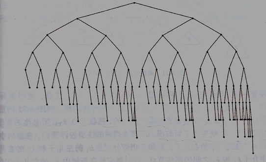

# 平衡二叉树\(Balanced BST\)

### 定义:

* 下面两个条件任何一个满足的时候我们就说给定的树是一个平衡二叉树:
  * 空树 或者
  * 左右两棵子树都是平衡二叉树并且左右两数的最大高度的差值不大于1

### 性质:

* 高度是O\(log\(n\)\) 参见图中的这颗平衡二叉树, 相对于满二叉树而言, 平衡二叉树只放宽了一个条件, 那就是左右子树的高度相差最多是1, 所以我们可以近似的把平衡二叉树看做满二叉树, 因此高度就是O\(log\(n\)\)
* 高度是O\(log\(n\)\)保证了查找的速度, 既查找也是O\(log\(n\)\)

